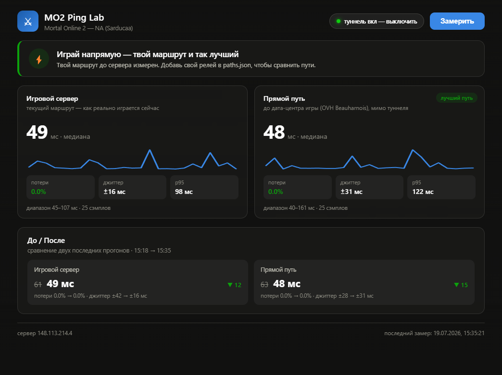

<div align="center">

# ⚔ MO2 Ping Lab

**Measure it before you pay for it.**
A network path analyzer for [Mortal Online 2](https://www.mortalonline2.com/) that shows whether a ping booster or relay would *actually* improve your connection — with real numbers, not marketing.

[](LICENSE)
[](#running-it)
[](https://www.electronjs.org/)
[](#contributing)



</div>

---

## The problem

Mortal Online 2 is a first-person melee MMO. Parries and swing timing live and die by latency — and even more by latency **stability**: a connection that sits at 45 ms and spikes to 150 ms feels far worse than a flat 60 ms.

The NA (Sarducaa) server runs out of OVH Beauharnois, Québec. Commercial boosters — ExitLag, GearUP, LagoFast — reroute your game traffic through private networks and charge a subscription for it. Sometimes that genuinely helps: bad ISP peering, evening congestion, packet loss. Just as often it does **nothing**, because your direct route is already near-optimal, and you're paying monthly for +3 ms of tunnel overhead.

There was no honest way for a player to know which case they're in. Now there is.

## What it does

One click measures three network paths **in parallel** and tells you which one wins:

| Path | What it tells you |
|---|---|
| **Game server** (current route) | How the game actually plays right now — measured through your VPN/tunnel if one is active |
| **Direct** (game's datacenter) | Your ISP's raw route to OVH Beauharnois, bypassing any tunnel |
| **Relay** *(optional)* | The same trip through your own WireGuard relay placed next to the game server |

Per path: **median · average · min/max · p95 · jitter (σ) · packet loss**, plus a sparkline of every sample. Runs are stored locally, and the app automatically pairs a *tunnel-off* run with a *tunnel-on* run into a **Before / After** comparison.

## How it works

- **RTT = TCP handshake time.** The game server drops ICMP (standard DDoS hygiene), so `ping` is useless against it — but it answers TCP on its game port, and one SYN → SYN-ACK round trip is exactly one network RTT. No admin rights, no raw sockets, no locale-dependent parsing.
- **Warm-up discard.** The first connection on Windows routinely costs hundreds of extra milliseconds (route/ARP warm-up). It's measured and thrown away so a single artifact can't wreck the jitter stats.
- **Tail-aware verdict.** Paths are scored as `median + (p95 − median) / 2`. A route that's *occasionally terrible* loses to one that's *consistently okay* — which is exactly how melee timing feels in game.
- **Tunnel awareness.** An active WireGuard interface (`wg*`) is detected automatically; the "game server" path then measures through it, because that's how you'd actually play.
- **Zero game interaction.** The tool talks to network endpoints only. It never reads game memory, never touches the game client, never injects anything.

## Running it

```bash
git clone https://github.com/YOUR_NAME/mo2-ping-lab
cd mo2-ping-lab
npm install
npm start          # dev run
npm run dist       # portable Windows .exe → dist/
```

Requirements: **Node 20+, Windows**. The built exe is portable — no installation, and measuring needs no admin rights.

## Bring your own relay

The point of a relay is to sit *physically next to the game server* (Montréal region for Sarducaa) and give your traffic a cleaner route than your ISP's default transit. A free-tier cloud VM with WireGuard is enough — measured from a Montréal datacenter, the hop to the game's datacenter is **~1.7 ms**.

Drop a `paths.json` next to the exe (overrides the bundled config, no rebuild) — see [`paths.example.json`](paths.example.json):

```jsonc
{
  "id": "relay",
  "name": "Via my relay",
  "host": "YOUR_RELAY_IP",   // any TCP port your relay answers on
  "port": 22,
  "extraMs": 1.7,            // relay → datacenter RTT, measured from the relay
  "role": "relay"
}
```

**Honest expectations, from real measurements:** if you're in the US East/Midwest, your direct route is probably already near-optimal and a relay adds ~3–5 ms for nothing. Relays win when your ISP's route to Québec is congested or lossy — common from Eastern Europe. Measure, don't guess.

## Roadmap

- [ ] EU entry node support (two-hop relay chains)
- [ ] Signed builds (no SmartScreen prompt)
- [ ] Configurable sample count / interval from the UI
- [ ] Linux / macOS build targets

## Contributing

Issues and PRs are welcome — especially measurement reports from different regions/ISPs (attach the Before/After screenshot). Dev loop: `PINGLAB_AUTOTEST=path\to\shot.png npm start` runs one full measurement, saves a window screenshot, and exits.

## Disclaimer

Community tool. Not affiliated with or endorsed by Star Vault AB. "Mortal Online" is a trademark of Star Vault AB — the name is used here only to describe compatibility.

## License

[MIT](LICENSE)
